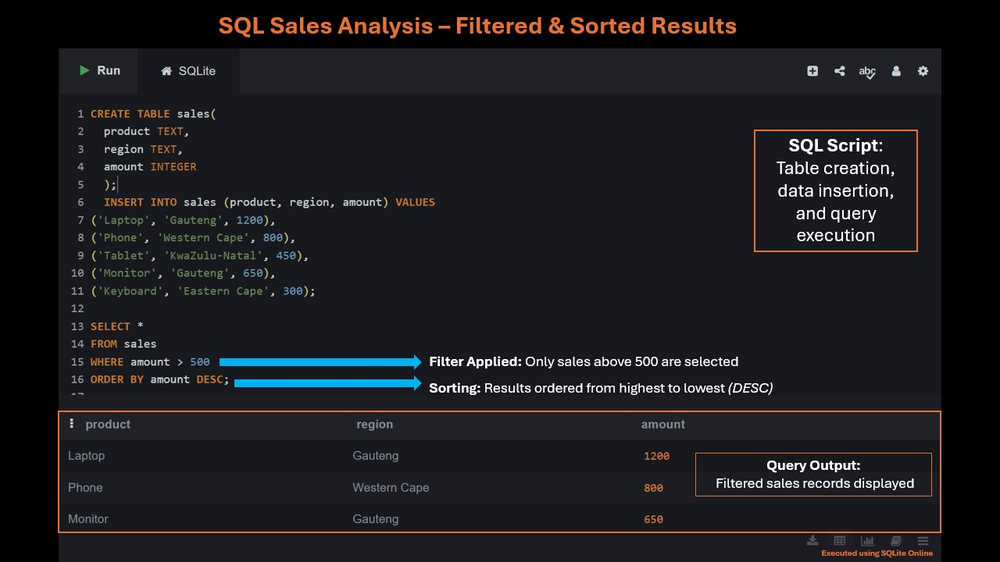

# 📊 SQL Sales Analysis

## 📌 Project Overview
This project demonstrates fundamental SQL skills by creating a sales dataset and performing data analysis using filtering and sorting techniques.

## 🎯 Objective
To extract meaningful insights by:
- Filtering sales records above a certain threshold
- Sorting results to identify top-performing sales

## 🗂 Dataset
A sample table called `sales` was created with the following fields:
- **product** – Name of the product
- **region** – Location of sale
- **amount** – Sales value

## ⚙️ SQL Operations Used
- `CREATE TABLE`
- `INSERT INTO`
- `SELECT`
- `WHERE`
- `ORDER BY`

## 💻 SQL Query
```sql
SELECT * 
FROM sales
WHERE amount > 500
ORDER BY amount DESC;
```

# 📊 Results

The query returns only sales greater than 500, sorted from highest to lowest:



🛠 Tools Used
SQLite Online
SQL

🚀 Key Learnings
How to structure a SQL table
Data insertion techniques
Filtering data using WHERE
Sorting results using ORDER BY

👩‍💻 Diana Chirwa
